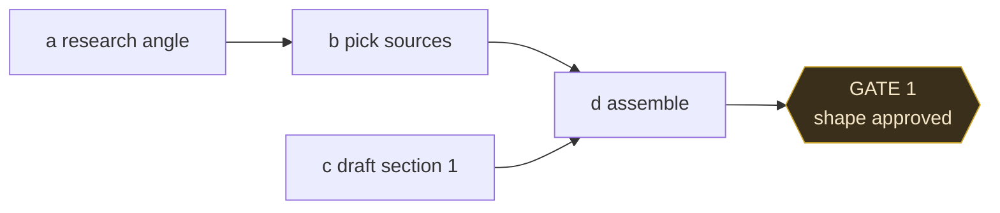

# Planning

Plan work as a directed acyclic graph before doing it. The DAG is the Planner
step from the harness article; brayness's plan doc inverts it - the agent
proposes, you approve, then execution runs. This skill never runs a crew solo.

## Roles -> one identity per phase

The arc as five fixed roles, used by name across this skill and AGENTS.md:

1. **Explorer** - figure out what the task really is. Only phase where digging
   is the right move; skip it once the ask is clear.
2. **Planner** - shape branchy work into a DAG and stop at Gate 1. Trivial or
   linear work skips the planner and passes straight through.
3. **Worker** - run nodes in topological order; plain execution is the default.
4. **Critic** - verify each node's output, cheapest deterministic check first.
5. **Promoter** - decide if verified work is worth showing off; most nodes
   never earn it.

Keep the names fixed (Explorer, Planner, Worker, Critic, Promoter) in docs,
plans files, and habit references — no "research phase" or "promote step"
aliases.

## When to use

- Work that branches, rejoins, or explodes like a mind map or creative project.
- Several pieces of work with dependencies between them.
- A task big enough that "just do it" would bury its own shape.

Skip it for trivial or purely linear tasks - planning has a cost, spend it where
it pays.

## Core rule: the graph is the plan, you are the gate

The DAG is a directed acyclic graph: nodes are units of work, edges are
dependencies. Build the graph, then check in with you at each decision gate.
You approve before anything executes. The agent never self-runs the whole DAG.

## Process

### 1. Planner - build the DAG

- List every unit of work as a node: id, one-line goal, effort (cheap/medium/expensive).
- Draw edges only where one node actually depends on another.
- Keep it a DAG - no cycles. A cycle means the plan is muddled; break it.
- Aim for small nodes that parallelize cleanly. Split anything that would become
  a paragraph to describe.

### 2. Planner - render the DAG for review

Render the graph so you can read it in one glance. **Use Mermaid**, in a fence
tagged `mermaid`:

````

````

The plan file is read in Obsidian, GitHub and editors, all of which render
Mermaid; ASCII box art is harder to read and much harder to edit when the graph
changes. Keep node ids as the first token of the label (`a1`, `b3`) so the prose
and the effort table can refer to them. Mark gates with the `{{...}}` hexagon
shape and the `gate` classDef above, so they stand out from work nodes.

Show effort per node in a table beside the diagram rather than crowding the
labels - Mermaid labels should stay to a few words.

Fall back to ASCII only when the output truly cannot render Mermaid and will
never be persisted, e.g. a throwaway sketch in terminal chat.

**Persist the DAG into `plans/`.** A plan worth building is worth keeping - it
is the reviewable artifact, not throwaway scaffolding. Write it into the
existing `plans/<plan>.md` (as a "DAG plan" section) or, if that file should
stay pure spec, a companion `plans/<plan>.plan.md`. Keep one file per plan;
do not proliferate. Record the gate decisions there too (approved shape,
changes you made, what the user chose). This is how plans actually live in
Scott's `plans/` and stay reviewable across sessions.

### 2b. Planner - write the plan so it stays readable

A plan file is read far more often than it is written, and it grows every
session. Length is the failure mode. The test for every line: **could someone
read this in the code?** If yes, cut it - the code is where it stays true.

What a plan carries:

- Decisions, and what was rejected.
- Open questions, named as questions.
- What to do next, and how to judge it.
- What the code cannot say: gotchas that bite you, evidence a check passed,
  why the thing exists at all.

What it does not carry:

- Restated docstrings, argument lists, or how a function works inside.
- A changelog. Git holds the history; a dated "what changed" list is the same
  facts a third time, and it is always the section that bloats.
- Finished work in full detail. Compress done rows to one line and keep the
  table for what is open.
- Prose explaining a command. Put the commands in one block and spend words
  only on what you would otherwise get wrong.

Re-read the whole file at the end of a working session and cut what the code
now says better. A plan that doubled in a day has usually absorbed a changelog.
See the `readable` skill for the sentence-level pass.

### 3. Gate 1 - approve the shape

Before any execution:

- Present the rendered DAG and the proposed order.
- Ask one question: is the shape right? Only what would change the plan's
  topology - added/removed/merged nodes, wrong dependencies, wrong order.
- Wait for your go before executing.
- If slices are wrong, revise the DAG and re-present. This gate is the
  human-decider contract.
- Record the outcome in the `plans/` file as soon as the shape is settled, so
  the artifact exists even if work pauses.

### 4. Worker - execute

Take nodes in topological order - every node only after its dependencies are
done. Run nodes that have no dependency between them in parallel where the
harness allows.

A "node" need not mean a subagent; plain execution is fine. Use a helper only
when a node genuinely benefits from isolation (heavy tooling, a different model,
a long-running chunk). Plain execution is the default.

### 5. Critic - verify before moving on

After each node (or at each merge point), apply the `critic` skill: cheapest
deterministic check first. If a node changes the shape of later work, pause and
check in before continuing to the next gate.

### 6. Promoter - tell people when it earns it

After the critic passes, ask: is this worth promoting? Two triggers:

- A feature that is genuinely fun or a great showcase of the service (e.g. the
  lava lamp feature).
- Documentation good enough to show off.

Channels: YouTube, TikTok, and the `About.vue` page. Motion graphics are the
preferred medium (see the `hyperframes` skill). Add promoter nodes to the DAG
like any other work - they gate on the feature being verified, and the human
approves the promo before it ships.

If neither trigger fires, skip this step; most nodes never earn promotion.

### 7. Gate 2 - check in at the end

Before calling anything done:

- Summarize what ran and what the DAG produced.
- Ask whether the result meets the plan or needs another pass.
- The final gate is yours; done is your call to make.

## Human-in-the-loop rules

- Every gate pauses for you. No autonomous "crew" run like the article's.
- One question at a time at each gate; no question bombs (see AGENTS.local).
- If a node would change the plan's shape mid-run, stop and re-present.
- For a task you've clearly underspecified, ask a focused clarifying question
  before building the DAG, not after.

## Cost and scope

- Planning is a cost, not an asset (see exploration-cost learning). A tidy
  one-screen DAG is the deliverable, not scaffolding files or scripts.
- The DAG goes in a `plans/` file (see step 2) because it is the reviewable
  plan artifact. This is distinct from throwaway exploration scaffolding - the
  plan earns its place by being the thing you review and reconsider.

## Related

- `critic` - the Critic role; producer never grades its own homework.
- `project-tooling` - read a project's scripts before planning execution inside it.
- `skill-finder` - when a node in the DAG needs a capability you don't have.
- `hyperframes` - motion graphics for the Promoter role.

## Source

Article: "Building an Advanced Agentic Harness" (data4sci, 2026-07-15), vault
clipping `work/Anotht/Clippings/Building an Advanced Agentic Harness.md`.
Goal doc: `work/Anotht/the-harness-is-the-thing.md` and the plan
`plans/harness-capabilities-internalize.md`.
